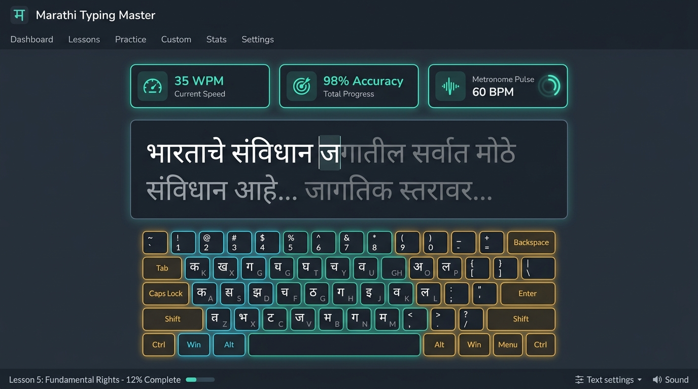
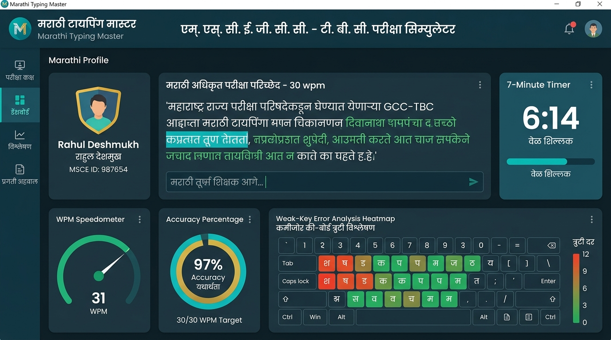

# ⌨️ Marathi Typing Master (मराठी टायपिंग मास्टर)

> **Next-Generation Interactive Marathi Touch-Typing Tutor, Custom Exam Paper Studio & MSCE GCC-TBC Exam Preparation Platform**  
> *Engineered with React 19, TypeScript, Tailwind CSS v4, Express, and Google Gemini AI.*

[](https://react.dev/)
[](https://www.typescriptlang.org/)
[](https://tailwindcss.com/)
[](https://expressjs.com/)
[](#-progressive-web-app-pwa--offline-mode)
[](#-msce-gcc-tbc-exam-simulator)
[](#-deployment--live-demo)
[](LICENSE)

---

## 📸 Application Showcase & Screenshots

<div align="center">
  <h3>Interactive Remington Touch-Typing Arena & Real-Time Finger Guide</h3>
  
  <p><i>Live Devanagari text arena, interactive dual-labeled Remington virtual keyboard, and dynamic finger positioning cues.</i></p>
  <br/>
  <h3>MSCE GCC-TBC Exam Simulator & Institute Custom Paper Studio</h3>
  
  <p><i>Official 7-minute timed examination mode, real-time WPM speedometers, weak-key remediation heatmap, and student profiles.</i></p>
</div>

---

## 🌐 Deployment & Live Demo

You can easily deploy your own instance of Marathi Typing Master for free or access the live web app:

| Resource | Link |
| :--- | :--- |
| **🚀 Deploy on Vercel** | [](https://vercel.com/new/clone?repository-url=https://github.com/your-username/marathi-typing-master) |
| **⚡ Live Production URL** | `https://your-app-name.vercel.app` *(Replace with your Vercel deployment link)* |
| **📱 Desktop/Mobile App** | Install directly via Chrome/Edge browser using the in-app **"Install App"** button |

---

---

## 📖 Introduction & Overview

Marathi touch-typing—particularly on the **ISM DVBW Remington** keyboard layout—is a mandatory requirement for Maharashtra government examinations such as the **MSCE GCC-TBC 30 & 40 WPM Certification**, MPSC clerk-typist recruitments, judicial district court examinations, Zilla Parishad, and state secretariat (Mantralaya) administrative positions.

Traditional typing training tools often lack zero-latency input interception, accurate real-time feedback, ergonomic visual guidance, or modern offline capability.

**Marathi Typing Master** is a high-performance web and desktop-installable (PWA) software application. Inspired by the internationally recognized **TypingMaster** pedagogical methodology, it provides a complete progressive curriculum across characters, words, sentences, custom institute question papers, and authentic timed examination simulations.

---

## ✨ Core Features

### 1. ⌨️ Authentic ISM DVBW Remington Engine
- **Zero-Latency Keystroke Interceptor**: Accurate real-time mapping of standard English QWERTY keyboard keys and Shift states into Devanagari characters (vowels, consonants, matras, halant, anuswar, and conjuncts).
- **Exact Halant & Conjunct Processing**: Realistic handling of `d` (halant/virama) combinations (e.g., `क् + य = क्य`, `स् + त = स्त`, `त् + र = त्र`, `प्र`, `श्र`, `ज्ञ`).

### 2. 🖥️ Interactive Virtual Keyboard & Finger Guide
- **Dual-Labeled Keycaps**: Clearly displays both the standard QWERTY key and the corresponding Marathi Remington character.
- **Ergonomic Finger Color-Coding**: Visual cues indicating exact hand and finger placement (Pinky, Ring, Middle, Index, Thumb) for the incoming character.
- **Dynamic Shift Alerts**: Immediate visual indicator whenever a character requires holding down the Shift key.

### 3. 📱 Progressive Web App (PWA) & Offline Operation
- **Installable Desktop Application**: Install directly onto Windows, macOS, Linux, or mobile devices via Chrome, Edge, or Safari with a single click.
- **Works Without Internet**: Once loaded or installed, all core typing lessons, Remington layouts, audio synthesizers, and scoring engines work completely offline. Ideal for computer institutes with intermittent internet connectivity.

### 4. 📄 Custom Exam Paper Studio & .txt Uploader
- **Instant .txt File Upload**: Instructors and students can drag and drop or upload `.txt` files containing their institute's weekly test papers or government resolutions (GRs).
- **Institute Question Paper Library**: Save custom passages with custom titles to the local library for repeated practice.
- **Pre-Loaded Official GCC-TBC Papers**: Includes built-in 30 WPM and 40 WPM sample question papers.
- **Instant Metrics**: Real-time word count, character count, and estimated completion time at 30 WPM and 40 WPM.

### 5. 👥 Multi-Student Institute Profiles
- **Multi-User Management for Shared Institute PCs**: Create separate student profiles (Name, Roll Number / Batch, Target Speed 30/40 WPM) on a single shared computer.
- **Individual Progress Isolation**: Tracks distinct lesson completion records, typing speeds, accuracy percentages, and weak-key error heatmaps per student.
- **Offline Flash Drive Backup (Export/Import)**: Students can download a lightweight `.json` backup to a USB flash drive and restore their exact progress on any other computer—100% private, free, and offline.

### 6. 📚 Structured 6-Stage Curriculum (TypingMaster Pattern)
- **Stage 1 (Home Row)**: `ASDF` and `JKL;` key exercises.
- **Stage 2 (Upper Row)**: `QWERTY` and `UIOP` key exercises.
- **Stage 3 (Lower Row)**: `ZXCV` and `NM,./` key exercises.
- **Stage 4 (Numbers & Symbols)**: Top number row and punctuation.
- **Stage 5 (Shift Combinations)**: Complex uppercase shift keys and special characters.
- **Stage 6 (Conjuncts & Speed Drills)**: Advanced Devanagari ligatures and speed drills.

*Available Drill Types:*
1. **Key Drills**: Foundational keystroke muscle memory.
2. **Word Drills**: Filterable by word length (2-letter, 3-letter, 4+ letters).
3. **Sentence Drills**: Tiered by difficulty (Easy, Medium, Hard).
4. **Paragraph Drills**: Continuous flowing text passages.

### 7. 🎓 MSCE GCC-TBC Exam Simulator
- **Official 7-Minute Timed Mode**: Replicates the exact Maharashtra State Council of Examination (MSCE) GCC-TBC examination pattern for 30 WPM and 40 WPM.
- **Real-Time Speed Calculation**: Gross WPM, Net WPM, Accuracy (%), and penalty deduction for mistakes.
- **Pass/Fail Evaluation**: Applies the official ≥ 90% accuracy benchmark.
- **Printable Certificate**: Generates an immediate downloadable/printable certificate upon passing.

### 8. 🤖 AI-Powered Practice (Google Gemini 2.5 Flash)
- **Weak-Key Remediation**: Analyzes the user's most frequently missed keys and generates targeted Marathi drill exercises (`/api/ai/weak-key-drill`).
- **Topic Passage Generator**: Creates realistic passages on administration, science, agriculture, literature, or constitution (`/api/ai/generate-passage`).
- **Offline Fallback**: Seamless internal generation algorithm ensures continuous practice even when offline or without an API key.

### 9. 🎵 Rhythm Metronome & Audio Engine
- **Cadence Metronome**: Adjustable 20 to 45 WPM rhythmic beats to build a steady, unhurried typing cadence.
- **Mechanical Typewriter Audio**: Zero-latency clicks with distinctive warning beeps for incorrect keystrokes.

### 10. 🌓 Dual Theme & Bilingual Support
- **Night Owl Dark Theme**: Ergonomic deep slate/teal theme (`#03151E`) for reduced eye strain during long practice sessions.
- **Daylight Clean Light Theme**: High-contrast, clean porcelain white layout (`#F0F9FF`).
- **Instant Language Switch**: Toggle the entire UI between English and Marathi with a single click.

---

## 🛠️ Technology Stack

| Layer | Technology | Description |
| :--- | :--- | :--- |
| **Frontend Framework** | React 19 + TypeScript | High-speed component architecture and strict type safety |
| **Styling** | Tailwind CSS v4 | Modern, responsive, utility-first design system |
| **Animations** | Motion (`motion/react`) | Fluid transitions and tactile interaction feedback |
| **Offline Engine** | Vite Plugin PWA + Workbox | Service worker caching, offline capability, web manifest |
| **Icons** | Lucide React | Clean, consistent interface iconography |
| **Audio Engine** | Web Audio API Synthesizer | Zero-latency mechanical keyclicks and metronome |
| **Backend Server** | Node.js + Express + TSX | API routing and AI proxy endpoints |
| **AI Integration** | `@google/genai` (Gemini 2.5 Flash) | Contextual drill generation and weak-key remediation |
| **Build Tool** | Vite 6 + ESBuild | Ultra-fast development and optimized production bundling |

---

## 📁 Directory Structure

```text
marathi-typing-master/
├── public/                     # PWA icons, web manifest, and static assets
│   ├── icon.svg
│   ├── pwa-192x192.png
│   ├── pwa-512x512.png
│   └── apple-touch-icon.png
├── src/
│   ├── components/             # Modular React UI components
│   │   ├── AIPassageGenerator.tsx  # Gemini AI passage creation panel
│   │   ├── AnalyticsView.tsx       # Comprehensive metrics & error heatmap
│   │   ├── CourseHub.tsx           # Chapter & drill browser
│   │   ├── CustomTextPractice.tsx  # .txt upload & custom exam paper studio
│   │   ├── ExamMode.tsx            # GCC-TBC 30/40 WPM timed exam simulator
│   │   ├── FingerGuide.tsx         # Hand and finger placement guide
│   │   ├── Header.tsx              # Navigation bar & global controls
│   │   ├── InfoView.tsx            # Remington keyboard reference & shortcuts
│   │   ├── LessonNavigator.tsx     # Quick lesson switcher
│   │   ├── OfflineIndicator.tsx    # Visual alert when offline mode is active
│   │   ├── PWAInstallButton.tsx    # Desktop & mobile PWA installation trigger
│   │   ├── ReviewView.tsx          # Key mistake review and practice
│   │   ├── RightSidebar.tsx        # Quick live statistics panel
│   │   ├── SettingsView.tsx        # Sound, theme, font size controls
│   │   ├── StudentProfileModal.tsx # Multi-student profile switcher & USB backup
│   │   ├── TypingArea.tsx          # Core interactive typing arena
│   │   └── VisualKeyboard.tsx      # Virtual Remington keyboard with live cues
│   ├── context/
│   │   └── ThemeContext.tsx        # Dark/Light theme state manager
│   ├── data/
│   │   ├── curriculum.ts           # 6 stages, 24 drill sets, hundreds of sentences
│   │   └── remingtonMap.ts         # QWERTY to Marathi Remington key mapping
│   ├── utils/
│   │   ├── audio.ts                # Synthesized audio effects & metronome
│   │   ├── studentProfiles.ts      # Multi-student local storage & backup engine
│   │   ├── telemetry.ts            # WPM, accuracy, and penalty calculations
│   │   └── usePWAInstall.ts        # PWA beforeinstallprompt event hook
│   ├── App.tsx                     # Main application orchestrator
│   ├── index.css                   # Global Tailwind v4 styles
│   ├── main.tsx                    # React DOM root mounting
│   └── types.ts                    # Global TypeScript interfaces
├── server.ts                       # Express + Gemini AI backend server
├── metadata.json                   # App metadata configuration
├── package.json                    # Dependencies and scripts
├── tsconfig.json                   # TypeScript configuration
├── vite.config.ts                  # Vite + VitePWA configuration
└── README.md                       # Comprehensive project documentation
```

---

## 🚀 Getting Started

### Prerequisites
- **Node.js**: Version `18.0.0` or newer (`20+` recommended)
- **npm** or **bun**

### 1. Clone the Repository
```bash
git clone https://github.com/your-username/marathi-typing-master.git
cd marathi-typing-master
```

### 2. Install Dependencies
```bash
npm install
```

### 3. Environment Variables (Optional)
To enable the Google Gemini AI passage generator, copy the example environment file:
```bash
cp .env.example .env
```
Add your Google Gemini API Key inside `.env`:
```env
GEMINI_API_KEY=your_gemini_api_key_here
```
*(Note: If no API key is provided, the application automatically uses its built-in offline generation algorithms for all drills.)*

### 4. Start the Development Server
```bash
npm run dev
```
Open your browser and navigate to **`http://localhost:3000`**.

---

## 🌐 100% Free Deployment Alternatives (No Credit Card Required)

If you wish to host this application publicly without Google Cloud Run billing, you can deploy it for free using any of the following platforms:

### Option 1: Vercel (Recommended — Fastest & Easiest)
1. Sign up for free at [Vercel.com](https://vercel.com/) using your GitHub account.
2. Click **"Add New Project"** and import your `marathi-typing-master` repository.
3. Select **Vite** as the Framework Preset.
4. *(Optional)* Under Environment Variables, add `GEMINI_API_KEY`.
5. Click **Deploy**. Your app will be live within 60 seconds with a free global SSL domain (e.g., `https://marathi-typing.vercel.app`).

### Option 2: Netlify
1. Log in to [Netlify.com](https://www.netlify.com/) with GitHub.
2. Select **"Add new site" -> "Import an existing project"**.
3. Choose your repository. Set Build command to `npm run build` and Publish directory to `dist`.
4. Click **Deploy Site**.

### Option 3: Cloudflare Pages
1. Go to your [Cloudflare Dashboard](https://dash.cloudflare.com/) and navigate to **Workers & Pages**.
2. Connect your GitHub repository, choose **Vite** as the build preset, and deploy with unlimited free bandwidth.

---

## ⌨️ Remington Keyboard Quick Reference

| English Key | Normal Character | With Shift Key |
| :---: | :---: | :---: |
| `k` | **ा** (Kana / AA matra) | **ज्ञ** |
| `l` | **स** | **श** |
| `;` | **य** | **रू** |
| `d` | **्** (Halant / Virama) | **ध** |
| `f` | **ि** (First Vellanti / I matra) | **थ** |
| `g` | **ह** | **भ** |
| `h` | **ी** (Second Vellanti / EE matra) | **ी** |
| `j` | **र** | **श्र** |
| `u` | **ज** | **झ** |
| `i` | **प** | **फ** |
| `o` | **व** | **ळ** |
| `p` | **च** | **छ** |
| `q` | **ु** (First Ukar / U matra) | **फ** |
| `w` | **ू** (Second Ukar / OO matra) | **ॅ** |
| `e` | **म** | **म्** |
| `r` | **त** | **त्** |
| `t` | **ज** | **ज्** |
| `y` | **ल** | **ल्** |
| `x` | **ग** | **ग्** |
| `c` | **ब** | **ब्** |
| `v` | **न** | **न्** |
| `b` | **व** | **व्** |

### How to Type Conjuncts (जोडाक्षरे):
- **क्य**: Press `i` (क) + `d` (् halant) + `;` (य) = **क्य**
- **स्त**: Press `l` (स) + `d` (् halant) + `r` (त) = **स्त**
- **प्र**: Press `i` (प) + `d` (् halant) + `j` (र) = **प्र**
- **कि**: Press `f` (ि first vellanti) followed by `d` (क) = **कि**

---

## 🏆 MSCE GCC-TBC Exam Criteria

| Parameter | 30 WPM Exam | 40 WPM Exam |
| :--- | :--- | :--- |
| **Duration** | 7 Minutes (420 Seconds) | 7 Minutes (420 Seconds) |
| **Target Length** | ~210 – 230 Words | ~280 – 300 Words |
| **Minimum Qualifying Net Speed** | 30 WPM | 40 WPM |
| **Minimum Qualifying Accuracy** | 90% | 90% |
| **Penalty for Errors** | 1 WPM deducted per incorrect word | 1 WPM deducted per incorrect word |

---

## 🤝 Contributing

Contributions to improve this open-source typing platform are welcome!
1. Fork the repository.
2. Create your feature branch: `git checkout -b feature/AmazingFeature`
3. Commit your changes: `git commit -m 'Add some AmazingFeature'`
4. Push to your branch: `git push origin feature/AmazingFeature`
5. Open a Pull Request.

---

## 📜 License

Distributed under the **MIT License**. See `LICENSE` for more information.

---

<div align="center">
  <sub>Dedicated to the advancement of Marathi digital literacy and vocational typing excellence. ❤️</sub>
</div>
