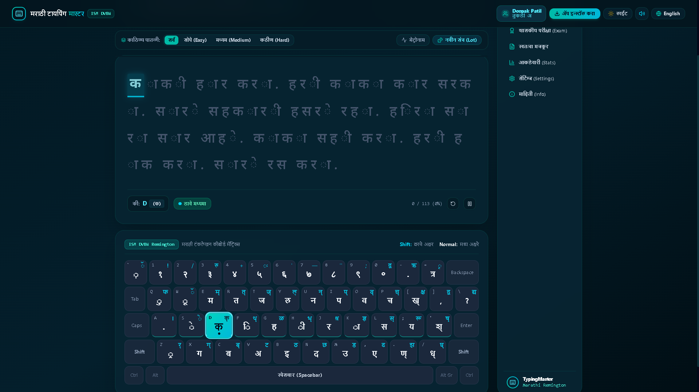
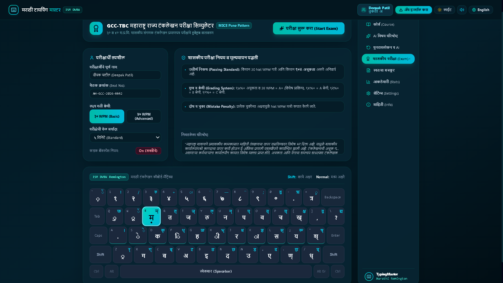

# ⌨️ Marathi Typing Master

> Learn, practise, and master Marathi typing with the ISM DVBW Remington layout.

[](https://marathi-typing-master.vercel.app/)
[](https://github.com/deepakpatil26/marathi-typing-master/releases/latest/download/MarathiTypingMasterSetup.exe)
[](https://react.dev/)
[](https://www.typescriptlang.org/)
[](LICENSE)

Marathi Typing Master is a free typing tutor for students, typing institutes, and anyone preparing for Marathi typing practice. It combines guided lessons, real-time feedback, GCC-TBC-style simulations, offline desktop use, and a clean Marathi-first interface.

## 🚀 Try it now

| Experience      | Link                                                                                                                                       |
| --------------- | ------------------------------------------------------------------------------------------------------------------------------------------ |
| Product website | [marathi-typing-master.vercel.app](https://marathi-typing-master.vercel.app/)                                                              |
| Browser app     | [Open the typing software](https://marathi-typing-master.vercel.app/?app=true)                                                             |
| Windows app     | [Download the latest `.exe`](https://github.com/deepakpatil26/marathi-typing-master/releases/latest/download/MarathiTypingMasterSetup.exe) |

The public URL is a landing page. Use the browser-app link for immediate practice, or install the Windows version for the recommended offline experience.

## ✨ Why it is useful

- **Authentic Remington practice** — QWERTY-to-Devanagari mapping, Shift characters, matras, halant, aliases, and conjunct sequences.
- **Progressive learning** — six stages that move from keys to words, sentences, paragraphs, and speed drills.
- **Live coaching** — WPM, net WPM, CPM, accuracy, mistakes, weak-character feedback, finger guidance, and an animated virtual keyboard.
- **Exam practice** — 30 WPM and 40 WPM targets, configurable 2/5/7/10-minute simulations, error penalties, and printable results.
- **Institute friendly** — separate student profiles, progress tracking, custom text practice, and JSON backup/export.
- **Offline by design** — the installed desktop app keeps core lessons, scoring, audio, and progress on the computer.
- **Light and dark themes** — Marathi and English interface options with responsive layouts.

## 🖼️ Product preview

<p align="center">
  
  
</p>

## 🪟 Install on Windows

1. Download `MarathiTypingMasterSetup.exe` from the link above.
2. Run the installer and approve the Windows administrator prompt.
3. Keep the default **Program Files** location, or choose another folder.
4. Leave the desktop shortcut option enabled if you want one.
5. Launch Marathi Typing Master from the desktop or Start Menu.

The installer is for **64-bit Windows** and includes an uninstaller. The packaged app is intended to work offline after installation. The release also provides a SHA-256 checksum when generated by the release workflow. Code signing is not currently configured, so Windows SmartScreen may show an unsigned-publisher warning.

## 🎓 Exam practice

The exam simulator is a training tool, not an official government examination or certificate.

| Setting       | Available practice                             |
| ------------- | ---------------------------------------------- |
| Target        | 30 WPM or 40 WPM                               |
| Duration      | 2, 5, 7, or 10 minutes                         |
| Default       | 7 minutes                                      |
| Metrics       | Gross WPM, net WPM, accuracy, errors, and time |
| Word standard | 5 characters per word                          |

Use the official examination notification or institute rules as the final authority for certification requirements.

## 🧭 Remington examples

The application displays the full keyboard and finger guidance. A few common examples:

| Key       | Output |
| --------- | ------ |
| `k`       | ा      |
| `f`       | ि      |
| `s`       | े      |
| `d`       | क      |
| `Shift+D` | क्     |
| `l`       | स      |
| `j`       | र      |
| `i`       | प      |

Conjuncts are practised as sequences, such as consonant + halant + consonant. The matcher also handles supported multi-codepoint and matra forms without displaying instructional dotted-circle artifacts in normal lesson content.

## 🛠️ Run locally

### Requirements

- Node.js 18 or newer
- npm

### Setup

```bash
git clone https://github.com/deepakpatil26/marathi-typing-master.git
cd marathi-typing-master
npm install
npm run dev
```

Open [http://localhost:3000](http://localhost:3000).

### Optional AI features

Set `GEMINI_API_KEY` in your environment to enable Gemini-powered passage generation. Core typing practice and built-in offline fallbacks work without an API key.

### Useful commands

```bash
npm run lint       # TypeScript validation
npm test           # Typing and scoring regression tests
npm run build      # Production web build
npm run dist:win  # Local Windows packaging
```

## 🧱 Built with

React, TypeScript, Vite, Tailwind CSS, Electron, Electron Builder, Express, Workbox/PWA, Lucide icons, and optional Google Gemini integration.

## 🤝 Contributing

Bug reports, Marathi content improvements, layout corrections, accessibility fixes, and feature ideas are welcome. Please open an issue first for large changes, then submit a focused pull request with relevant tests.

## 📄 License

Released under the [MIT License](LICENSE).

<p align="center">
  <sub>Built to make Marathi digital literacy and typing practice more accessible.</sub>
</p>
